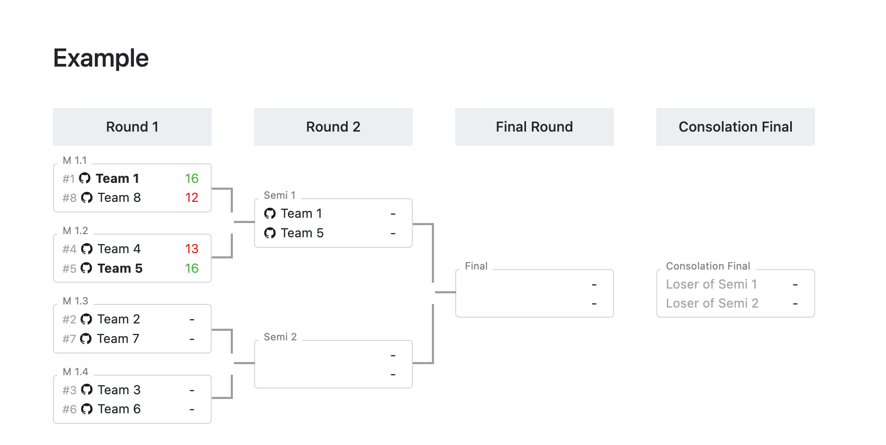

# brackets-viewer.js

[](https://www.npmjs.com/package/brackets-viewer)
[](https://www.npmjs.com/package/brackets-viewer)
[](https://www.jsdelivr.com/package/npm/brackets-viewer)
[](https://packagequality.com/#?package=brackets-viewer)

A simple library to display tournament brackets (round-robin, single elimination, double elimination)

It contains all the logic needed to display tournaments.

### Features

- Supports translation ([i18next](https://www.i18next.com/)), which also allows you to change the vocabulary
- It was developed in vanilla JS, so you can [use it in any framework](https://github.com/Drarig29/brackets-viewer.js/discussions/74)
- A full working example of creating and displaying brackets (see [`./demo/with-ui.html`](demo/with-ui.html))
- Themes supported, with CSS variables (see [`./demo/themes`](/demo/themes))
- Display participant images next to their name ([example](https://github.com/Drarig29/brackets-viewer.js/blob/668aae1ed9db41ab21665459635cd6b71cad247c/demo/with-api.html#L34-L38))
- Do actions when a match is clicked ([example](https://github.com/Drarig29/brackets-viewer.js/blob/ed31fc4fc43336d3543411f802a8b1d9d592d467/demo/with-api.html#L53), [feature request](https://github.com/Drarig29/brackets-viewer.js/discussions/80))
- Custom round names: do you want to say "Semi Finals" instead of "Round 2"? ([example](https://github.com/Drarig29/brackets-viewer.js/blob/ed31fc4fc43336d3543411f802a8b1d9d592d467/demo/with-api.html#L46-L52), [feature request](https://github.com/Drarig29/brackets-viewer.js/discussions/93))



## How to use?

Import the library from npm using [jsDelivr](https://www.jsdelivr.com/) (you can replace `@latest` to lock a specific version):

```html
<link rel="stylesheet" href="https://cdn.jsdelivr.net/npm/brackets-viewer@latest/dist/brackets-viewer.min.css" />
<script type="text/javascript" src="https://cdn.jsdelivr.net/npm/brackets-viewer@latest/dist/brackets-viewer.min.js"></script>
```

Or from GitHub with (you can replace `@master` by any branch name, tag name or commit id):

```html
<link rel="stylesheet" href="https://cdn.jsdelivr.net/gh/Drarig29/brackets-viewer.js@master/dist/brackets-viewer.min.css" />
<script type="text/javascript" src="https://cdn.jsdelivr.net/gh/Drarig29/brackets-viewer.js@master/dist/brackets-viewer.min.js"></script>
```

Now, you can use it with data generated using [brackets-manager](https://github.com/Drarig29/brackets-manager.js) or with crafted data following the [brackets-model](https://github.com/Drarig29/brackets-model).

**Usage:**

This will find a **unique** element with a `.brackets-viewer` class, and **append** to it:

```js
window.bracketsViewer.render({
  stages: data.stage,
  matches: data.match,
  matchGames: data.match_game,
  participants: data.participant,
});
```

If you want to clear the container's content before rendering again, use this:

```js
window.bracketsViewer.render({
  stages: data.stage,
  matches: data.match,
  matchGames: data.match_game,
  participants: data.participant,
}, {
  clear: true,
});
```

If you have multiple elements with a `.brackets-viewer` class, you must provide a `selector`:

```js
window.bracketsViewer.render({
  stages: data.stage,
  matches: data.match,
  matchGames: data.match_game,
  participants: data.participant,
}, {
  selector: '#example',
});
```

See the [full documentation](https://drarig29.github.io/brackets-docs/reference/viewer/interfaces/Config.html) for the `render()` configuration.

## Demos

To quickly test, you can also try the demos by visiting `./demo/index.html`.

To use `json-server`, you can:

- Run the npm script named `db` to serve the static database file `./demo/db.json`

  ```bash
  npm run db
  ```

- Or use directly the `db.json` file generated by unit tests in the `brackets-manager` project

  ```bash
  npx json-server --watch path/to/brackets-manager/db.json
  ```

## Credits

This library has been created to be used by the [Nantarena](https://nantarena.net/).

It has been inspired by:

- [Toornament](https://www.toornament.com/en_US/) (design inspiration)
- [Responsive Tournament Bracket](https://codepen.io/jimmyhayek/full/yJkdEB) (connection between matches in plain CSS)
